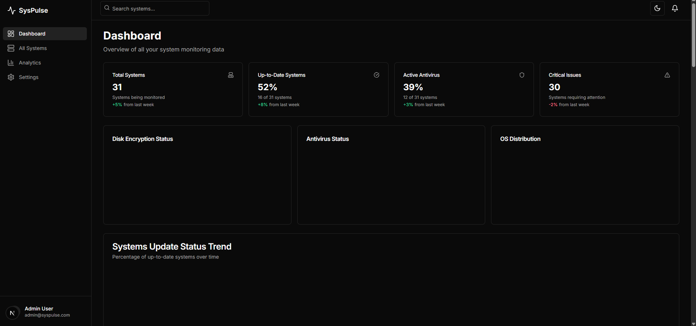

# 🖥️ SysPulse

**SysPulse** is a cross-platform system utility tool that monitors machine health metrics like disk encryption, OS update status, antivirus status, and sleep settings — with centralized reporting and a dashboard view.

---

##Architecture

```
 ┌─────────────┐        HTTP POST       ┌─────────────┐       API        ┌──────────────┐
 │ Golang CLI  ├───────────────────────►│ Express API │◄────────────────►│ Next.js UI   │
 └─────────────┘                        └─────────────┘                  └──────────────┘
       ⬇
 [Disk, OS, Antivirus Checks]
```
Image



---

## 📦 Tech Stack

| Layer      | Tech Used                |
|------------|--------------------------|
| Utility    | Go (v1.20+)              |
| Backend    | Express.js (Node.js)     |
| Frontend   | Next.js (v14+)           |
| DB         | MongoDB                  |

---

## 🔧 Setup Instructions

### 1. Clone the Repo

```bash
git clone https://github.com/yourusername/syspulse.git
cd syspulse
```

---

### 2. Setup Go Utility (System Agent)

```bash
cd syspulse/cmd
go build -o syspulse.exe main.go
./syspulse.exe
```

> ℹ️ Make sure your Go version is ≥ 1.20. Only Windows checks are supported currently.

---

### 3. Setup Express Backend (API)

```bash
cd server
npm install
node index.js
```

#### 🔗 API Endpoints

- `POST /api/register` — Register system
- `POST /api/report` — Send health report
- `GET /api/systems` — View all systems

---

### 4. Setup Next.js Frontend (Dashboard)

```bash
cd client
npm install
npm run dev
```

Access UI at: [http://localhost:3000](http://localhost:3000)

---

## 📁 Folder Structure

```
syspulse/
├── cmd/                  # Golang CLI main entry
├── internal/checks/     # Disk, OS, AV checks
├── utils/               # Common utils (e.g., system ID)
├── config/              # Config files
└── README.md
server/            # Express API (MVC)
├──        
client/            # Next.js dashboard
├──           
```

---

## 🔐 Key Features

- ✅ Disk encryption check (BitLocker, FileVault, LUKS)
- 🔁 OS update status (Current vs Latest)
- 🛡️ Antivirus status (presence & activity)
- 🌙 Sleep timeout check
- 📡 Sends reports to central backend
- 📊 Dashboard visualization

---

## 🧪 Testing

Run test report manually:
```bash
cd sysutility
go run cmd/main.go
```
or 

```bash
cd sysutility
go run ./cmd  
```

